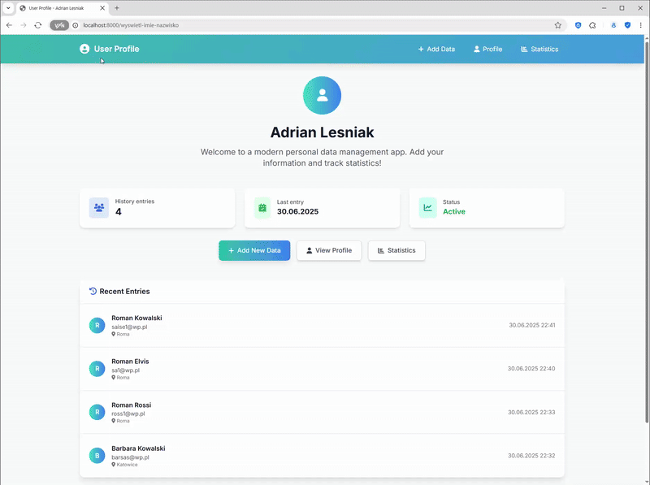

# 👤📊 UserProfile360: Modern Personal Data Dashboard 🇬🇧
_A Laravel-based web application for managing personal data, statistics, and user profiles, featuring a modern UI, dynamic charts, and secure user authentication. Interface in English._

[](https://opensource.org/licenses/MIT)
[](https://www.php.net/)
[](https://laravel.com/)
[](https://tailwindcss.com/)
[](https://www.chartjs.org/)

## 📋 Table of Contents
1. [Overview](#-overview)
2. [Key Features](#-key-features)
3. [Screenshots (Conceptual)](#-screenshots-conceptual)
4. [Technology Stack & Requirements](#-technology-stack--requirements)
5. [Local Development Setup](#️-local-development-setup)
6. [Usage Guide](#️-usage-guide)
7. [Project File Structure (Laravel Standard)](#️-project-file-structure-laravel-standard)
8. [Important Notes & Considerations](#-important-notes--considerations)
9. [Contributing](#-contributing)
10. [License](#-license)
11. [Contact](#-contact)

## 📄 Overview

**UserProfile360**, developed by Adrian Lesniak, is a modern web dashboard for managing personal data, user profiles, and statistics. Built with the **Laravel PHP framework**, it allows users to add, view, and analyze their personal information, track history, and visualize trends with interactive charts. The application features a responsive, stylish interface (Tailwind CSS), secure authentication, and a focus on user experience. All content is presented in **English**.

<p align="center">
  
</p>

## ✨ Key Features

*   👤 **Personal Data Management**: Add, edit, and view your personal details (name, email, phone, city, profession, hobby, date of birth).
*   📈 **Dynamic Statistics**: Visualize your data with real-time charts (age distribution, activity timeline, and more).
*   🕑 **History Tracking**: See your last 10 data entries, with timestamps and quick stats.
*   🔒 **User Authentication**: Secure registration, login, and session management (Laravel Breeze ready).
*   🖥️ **Modern Responsive UI**: Built with Tailwind CSS and Font Awesome for a clean, mobile-friendly experience.
*   🗂️ **Profile Dashboard**: Centralized dashboard with quick access to all features.
*   📝 **Validation & Error Handling**: All forms include robust validation and user-friendly error messages.
*   🌐 **English Interface**: All UI elements, messages, and documentation are in English.
*   📊 **Interactive Charts**: Age group pie chart and activity timeline powered by Chart.js, reflecting real user data.
*   🧑‍💻 **Author Attribution**: Footer credits Adrian Lesniak.

## 🖼️ Screenshots (Conceptual)

_Conceptual screenshots: dashboard, add data form, profile view, statistics page._

<p align="center">
  
  
  
  
  
  
  
</p>


## 🛠️ Technology Stack & Requirements

### Core Technologies:
* **Backend**: PHP >= 8.2, Laravel 10
* **Frontend**: HTML5, Tailwind CSS, JavaScript (ES6+), Chart.js, Font Awesome
* **Dependency Management**: Composer, npm
* **Authentication**: Laravel Breeze (recommended)

### Development Environment (Recommended):
* **Web Server Stack**: XAMPP, WAMP, MAMP, Laragon, or built-in Laravel server
* **IDE**: VS Code, PhpStorm, or any preferred editor
* **Composer**: Globally installed
* **Node.js & npm**: For frontend asset compilation

### Local Assets (Standard Laravel Structure):
* `public/`: Compiled CSS, JS, images
* `resources/views/`: Blade templates
* `storage/`: Logs, sessions, cached views

## ⚙️ Local Development Setup

1. **Clone the Repository**:
    ```bash
    git clone <repository-url>
    cd Zadanie2
    ```
2. **Install Dependencies**:
    ```bash
    composer install
    npm install
    npm run build
    ```
3. **Environment Configuration**:
    * Copy `.env.example` to `.env`:
        ```bash
        cp .env.example .env
        ```
    * Generate application key:
        ```bash
        php artisan key:generate
        ```
    * (Optional) Configure database in `.env` if using authentication or persistent storage.
4. **Database Setup** (if using authentication):
    * Run migrations:
        ```bash
        php artisan migrate
        ```
5. **Serve the Application**:
    ```bash
    php artisan serve
    ```
    Access at [http://localhost:8000](http://localhost:8000)

## 💡 Usage Guide

1. **Access the App**: Open [http://localhost:8000](http://localhost:8000) in your browser.
2. **Register/Login**: Use the authentication system to create an account and log in.
3. **Add Data**: Go to "Add Data" to submit your personal information.
4. **View Profile**: See your latest data and quick stats on the profile page.
5. **Check Statistics**: Explore the "Statistics" page for interactive charts and data analysis.
6. **Edit or Clear History**: Manage your data entries and clear history as needed.

## 🗂️ Project File Structure (Laravel Standard)

* `app/`: Controllers, Models, Providers
* `config/`: Configuration files
* `database/`: Migrations, factories, seeders
* `public/`: Public assets and entry point
* `resources/`: CSS, JS, Blade views
* `routes/`: Web and API routes
* `storage/`: Logs, cache, sessions
* `tests/`: Unit and feature tests
* `vendor/`: Composer dependencies
* `.env`: Environment config
* `composer.json`: Composer dependencies
* `README.md`: This documentation

## 📝 Important Notes & Considerations

* **English UI**: All interface elements and messages are in English.
* **Security**: CSRF protection, password hashing, XSS prevention, and SQL injection protection via Laravel.
* **Frontend**: Uses Tailwind CSS and Chart.js for a modern, interactive experience.
* **Authentication**: Laravel Breeze recommended for user management.
* **Demo Data**: If no data is present, the app will prompt you to add your first entry.
* **Customization**: Easily extendable for more fields, analytics, or multi-user support.

## 🤝 Contributing

Contributions are welcome! To contribute:
1. Fork the repository
2. Create a new branch (`git checkout -b feature/YourFeature`)
3. Make your changes and add tests
4. Commit and push (`git commit -m 'Feature: YourFeature'`)
5. Open a Pull Request with a clear description

## 📃 License

This project is licensed under the **MIT License**. See the LICENSE file for details.

## 📧 Contact

Project developed by **Adrian Lesniak**
For questions, feedback, or issues, please open an issue on GitHub or contact the author.

---
🚀 _Empowering users with data-driven insights, built with Laravel and Tailwind CSS._
